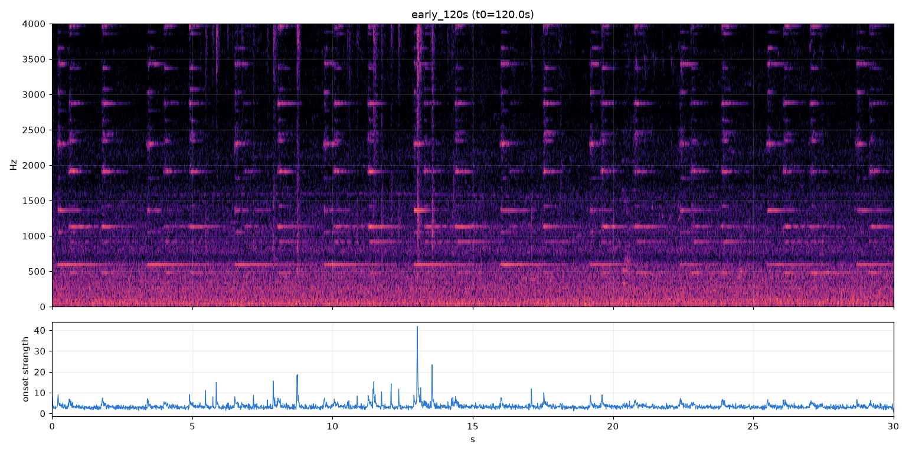
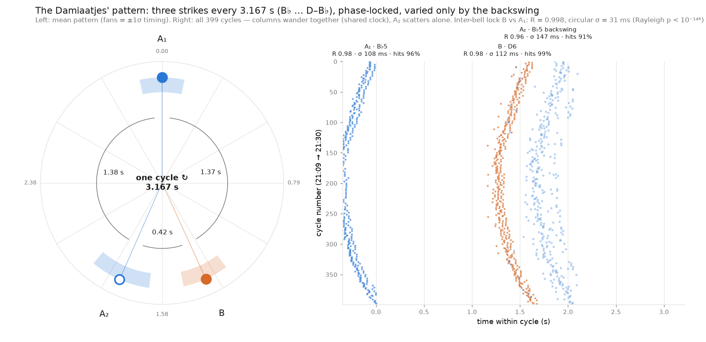
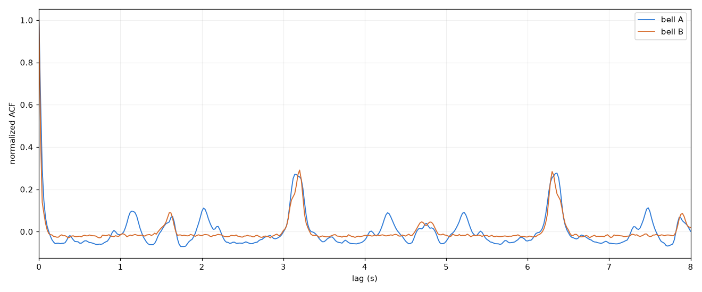
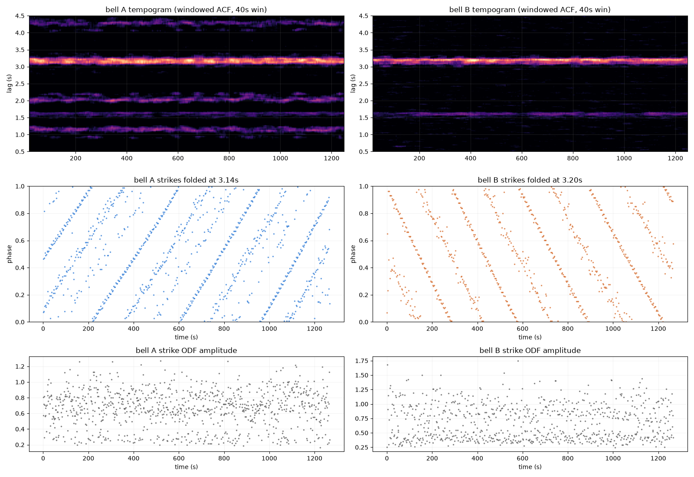
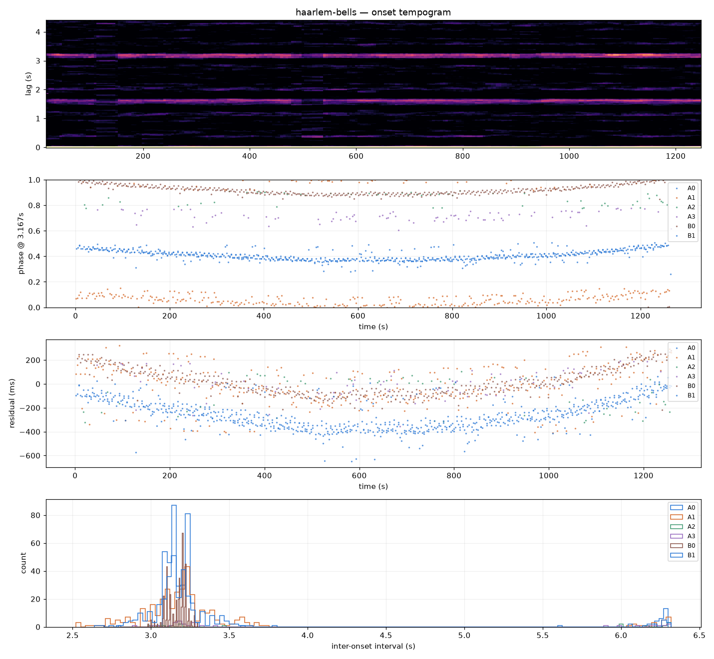
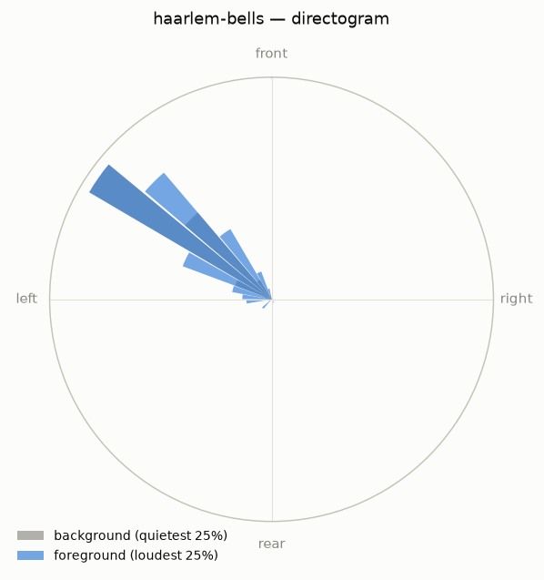
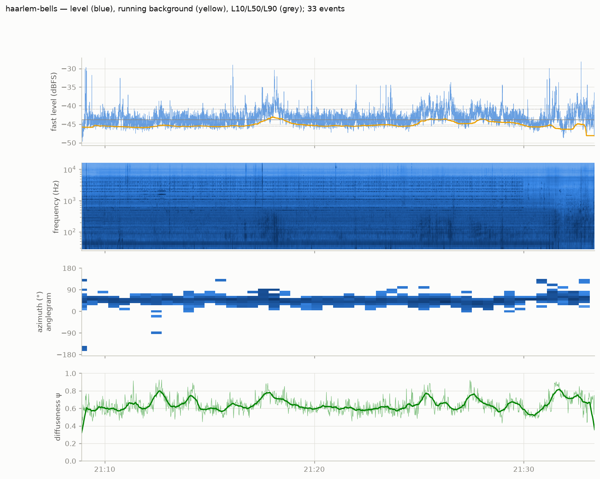
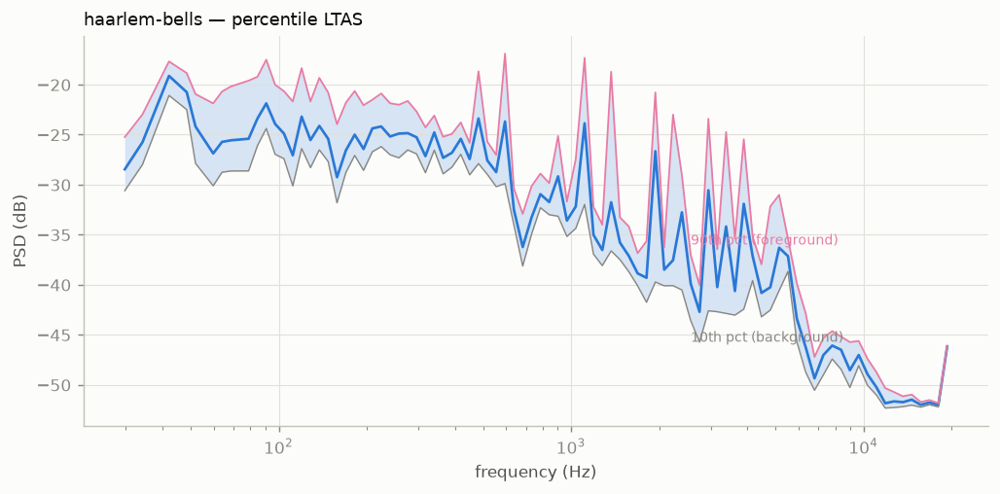
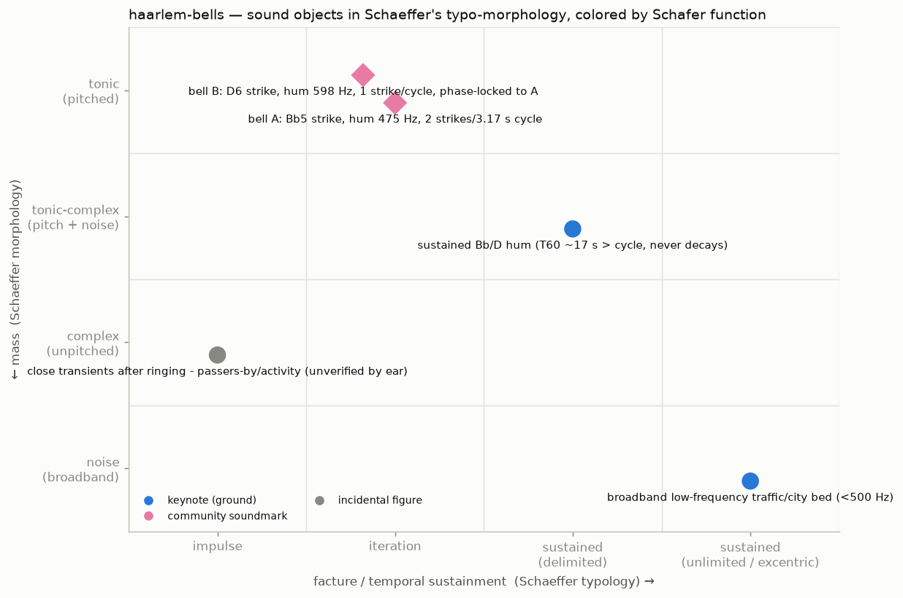
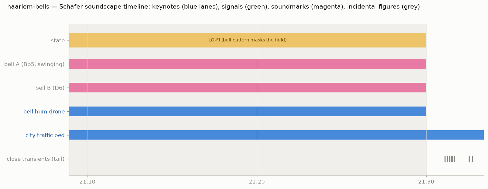

# Haarlem Damiaatjes — rhythmic and soundscape analysis

**Recording:** `260717_001.WAV`, Zoom H3-VR, AmbiX B-format (W/Y/Z/X), 48 kHz/24-bit,
24.5 min. Recorded 2026-07-17. The recorder clock was ~11 min 5 s slow: the
ringing ends at file-time 1266 s, which corresponds to 21:30:00 sharp, so the
**true recording span is 21:08:54–21:33:24**. The bells — the *Damiaatjes* of the
Grote Kerk (St. Bavo), rung nightly 21:00–21:30 — are already ringing at the start.

Analysis with [ambiscape](https://github.com/fourMs/ambiscape) (`analyze`,
`taxonomy`, `iso`, and the new `rhythm` command written for this session), plus
session-specific verification scripts.

## 1. The two bells

Partials detected from the per-minute mean PSD (bell-active vs. quiet minutes),
grouped into sources by strike-synchronous envelope correlation:

| | Bell A | Bell B |
|---|---|---|
| hum | 475 Hz (1.00×) | 592–598 Hz (0.99×) |
| prime | ~920 Hz (1.94×) | ~1055 Hz (1.76×, flat) |
| tierce | 1131 Hz (2.38×) | 1359 Hz (2.27×) |
| quint | 1424 Hz (3.00×) | 1816 Hz (3.04×) |
| nominal | 1910 Hz (4.02×) | 2303 Hz (3.85×) |
| strike note | ≈955 Hz ≈ **A♯5/B♭5 (+42 c)** | ≈1152 Hz ≈ **D6 (−35 c)** |

Bell A is close to the textbook minor-third profile (1 : 2 : 2.4 : 3 : 4). Bell B
deviates (flat prime and nominal) — an older-style, less "tuned" profile. The
interval between the strike notes is ~3.2 semitones, a slightly wide minor third.

**Timbre.** Decay is strongly partial-dependent (median dB/s over 0.1–1 s
post-strike): A's hum ~17 s T60-equivalent, prime ~7.5 s, tierce ~4.1 s, nominal
~2.0 s (B: 9.3 / 6.3 / 3.1 / 2.0 s). Since the hum outlives the 3.17 s cycle by
far, the pattern rides on a **continuous B♭+D drone** that never decays during the
21 minutes. Bell A carries two pairs of closely spaced components (2438/2467 and
3967/3996 Hz, ~29 Hz apart) that add sensory roughness to its strike. The strike
transient's high partials (>2.8 kHz) decay in 1–2 s, so each strike is a bright
attack collapsing into the drone.

*Figure 1 — 30 s excerpt (0–4 kHz spectrogram, top; band-limited spectral-flux
onset function, bottom). Each bell strike appears as a vertical attack followed
by long horizontal partial traces (the stacked lines at 475/920/1131/1910 Hz
etc. are bell A, 598/1365/2303 Hz bell B); the pink floor below ~500 Hz is the
continuous traffic bed. The onset function's peaks are the raw material for all
strike detection.*

## 2. The rhythmic pattern

*Figure 2 — the pattern itself. Left: one 3.167 s cycle as a clock — filled
blue dot = bell A's main strike (A₁), orange = bell B, hollow blue = A's
backswing strike (A₂); shaded fans span ±1 SD of timing jitter, arc labels give
the inter-onset intervals. Right: every one of the 399 cycles, one row per
cycle from 21:09 (top) to 21:30 (bottom) — the A₁ and B columns bend in
parallel (the shared clock wandering ±100 ms), while the hollow A₂ column
scatters independently and shows gaps (missed backswing strikes).*

*Figure 3 — autocorrelation of each bell's onset function over the whole bout.
Both peak at the common ~3.17 s cycle; bell A's secondary peaks at 1.14 s and
2.02 s (summing to the cycle) reveal its asymmetric double strike, bell B's
single 1.6 s sub-peak its near-even spacing (later shown to be the cross-talk
image of A₁ rather than a second B strike).*

*Figure 4 — time-resolved view per bell. Top: windowed-ACF tempograms — the
periodicity ridges hold steady for 21 minutes. Middle: strike times folded at
fixed trial periods (3.14 / 3.20 s); the slanted line means the true period
differs slightly from the fold period — both bells' lines correspond to the
same true period, 3.1669 s. Bottom: strike-to-strike onset amplitudes (CV ≈
0.2, no systematic fade until the end).*

*Figure 5 — output of the new `ambiscape rhythm` command on this session:
onset tempogram (top), strike phases at the common period, cycle-grid timing
residuals, and per-stream IOI histograms. Streams A0/B1 are flagged as
cross-talk suspects by the module and correspond to the same physical strikes.*

- **Cycle period: 3.1669 s** (Rayleigh point-process estimate over 399 cycles;
  both bells identical to <1 ms).
- Three strikes per cycle: **A₁ → (1.37 s) → B → (0.42 s) → A₂ → (1.38 s) → A₁′** —
  a long–short–long pattern; melodically B♭ … D–B♭, the D anticipating the second
  B♭ by 0.42 s. (A fourth apparent stream — "B" strikes coincident with A₁ — is
  cross-talk: its strike-triggered rise spectrum contains only bell A partials.)
- Bell A strikes twice per cycle (swing strike + backswing strike, asymmetric at
  0 / 0.66 of the cycle); bell B strikes once per cycle.

**Repetition vs. variation** (per-cycle residuals against a rigid 3.1669 s grid):

| position | hit rate | timing SD | slow wander SD | cycle-to-cycle SD | lag-1 r |
|---|---|---|---|---|---|
| A₁ | 96% | 108 ms | 105 ms | 29 ms | 0.88 |
| B  | 99% | 112 ms | 106 ms | 35 ms | 0.85 |
| A₂ | 91% | 147 ms | 83 ms  | 115 ms | 0.25 |

- A₁ and B timing residuals are correlated at **r = 0.96**: the cycle *clock
  itself* wanders slowly (±~100 ms over minutes) while cycle-to-cycle jitter is
  only ~30 ms. The two bells are **phase-locked**: B sits at a fixed 1.632 s
  (0.43–0.52 cycle) after A₁ with just **7 ms SD of relative phase over 20
  minutes**. Independent swinging bells cannot do this; the two bells behave as
  one mechanically coordinated system (shared drive/automation — or, if they are
  genuinely independent pendulums, a remarkably strong entrainment).
- **Both bells physically swing** (`rhythm.partial_fm`, weighted-LS
  estimator): each bell's partials are frequency-modulated at the cycle rate —
  Doppler from the moving bell — at 2.35 cents (A nominal) and 1.26 cents
  (B nominal), 30–60× above an off-rate control. So B is not chimed: it swings
  but sounds only one audible strike per cycle, and the millisecond lock
  between two *swinging* bells is a genuine mechanical-synchronization
  observation.
- MIR cross-check (`ambiscape music`, librosa): the chromagram confirms the
  C♯/A♯/D tonal content, while librosa's global tempo (123 BPM) illustrates a
  methodological point — standard MIR tempo priors assume musical tempi and
  miss the true 18.9 "BPM" (3.167 s) environmental cycle, which the windowed
  ACF tempogram captures.
- **A₂ — the backswing strike — is the free agent**: 115 ms cycle-to-cycle
  jitter, low autocorrelation, 9% missed cycles, and only r ≈ 0.6 correlation
  with the rest. The "life" in the pattern is clapper physics on the backswing.
- Strike amplitude varies with CV ≈ 0.2 at all three positions.
- Stability is U-shaped over the bout: timing SD ~86–90 ms in the first third,
  34–38 ms mid-bout, ~95–103 ms in the final third (start-up and wind-down).

**Circular statistics** (phases at P = 3.1669 s): A₁ R = 0.976, B R = 0.976,
A₂ R = 0.959 (circular SD 111 / 112 / 146 ms; Rayleigh p < 10⁻¹⁴⁶ for all —
the periodicity is beyond doubt). The sharpest number is the *relative* phase:
B measured against the preceding A₁, per strike, gives mean offset 0.515
cycle (1.631 s) with **R = 0.998, circular SD 31 ms** — strike-level phase
locking. (The 7 ms figure quoted earlier is the SD of 60 s-windowed mean
phases, i.e. the lock of the underlying clocks once per-strike jitter is
averaged out.)

## 3. Spatial character

Whole-session azimuthal concentration is extreme (R = 0.95, mean ~52°;
foreground events 55°). Per-strike DOA from partial-band pseudo-intensity is
**frequency-dependent** (azimuth 0–70° depending on the partial band analyzed,
R ≈ 0.4–0.8): the bell energy arrives through a reflection-dominated street
canyon, so the direct bearing per bell cannot be pinned down; both bells come
from the same general sector, near 0° elevation. Diffuseness ψ ≈ 0.63 (median)
with IQR 0.12, oscillating with the strike/reverberation cycle.

*Figure 6 — directogram (energy by azimuth over time). The bright band around
~50° is the bells-plus-traffic sector that dominates the whole session; no
second source direction emerges, consistent with the reflection-dominated
propagation described above.*

## 4. The rest of the soundscape

*Figure 7 — ambiscape session overview on the corrected clock: fast level with
running background and detected events (top), log-frequency spectrogram — note
the dense bell band ending at 21:30 sharp —, azimuth anglegram, and
diffuseness ψ. The post-21:30 tail shows the level drop and the close
transients near 21:31–21:32.*

*Figure 8 — long-term spectrum percentiles (L10/L50/L90 per frequency). The
narrow spikes between 400 Hz and 4 kHz are the bell partials standing 10–25 dB
above the smooth traffic continuum; the gap between L10 and L90 at those
frequencies reflects the strike/decay cycling.*

- **Keynote bed:** broadband low-frequency city/traffic noise (<500 Hz),
  continuous throughout (spectral flatness median 0.007, centroid median 532 Hz).
- During ringing the field is **lo-fi** in Schafer's terms — but the masking is
  frequency-selective (`background.masking_index`): the bells elevate the
  typical spectral floor by **9–14 dB in their partial bands** (1.1, 1.9, 2.9,
  3.3, 3.8 kHz; 16% of bands > 6 dB) while the median elevation across
  250 Hz–8 kHz is only 1.3 dB. The dominant level-modulation of the section is
  0.63 Hz = the mean strike rate (2 strikes / 3.17 s).
- **After the bells stop** (21:30–21:33): median level drops ~8 dB (L50 −52 vs.
  −43.7 dBFS full-session); level modulation becomes slow and aperiodic
  (dominant components at ~43 s, ~11 s, ~6 s — traffic waves), punctuated by
  9 close transients (passers-by/activity; unverified by ear).
- ambiscape event detector: 31 events/24.5 min ≥8 dB above running background.

*Figure 9 — the session's sound objects on Schaeffer's facture × mass plane,
colored by Schafer function: the two bells are iterated tonic objects and
community soundmarks (magenta diamonds); the bell-hum drone a sustained
tonic-complex keynote; the traffic bed an unlimited noise keynote; the tail
transients unclassified impulsive figures.*

*Figure 10 — the same objects on the corrected session clock: the bells and
hum drone span 21:00 (already ringing at record start, 21:08:54) to exactly
21:30, the lo-fi state coincides with them, the traffic keynote runs
throughout, and the close transients cluster after the ringing.*

## 5. ISO 12913 framing

Per ISO 12913-1, the *soundscape* is the acoustic environment **as perceived in
context**; instrumental data support but do not replace listener assessment. A
defensible description:

- **Context (Part 1):** historic city centre, summer evening, commemorative
  nightly bell ringing (community soundmark with 800 years of continuity),
  listener outdoors at street level.
- **Sound sources (Part 2 taxonomy):** dominant — bells (human/cultural
  signals); background — road traffic; occasional — human activity transients.
- **Perceived affective quality (Part 2 circumplex):** the measured profile
  (high eventfulness, strong tonal content, regular pattern, moderate loudness,
  low roughness between strikes) predicts placement in the **vibrant**
  (eventful-and-pleasant) quadrant for most listeners, shifting toward **calm**
  after 21:30. This is a prediction — a Method A questionnaire on site would be
  needed for a standard-conformant claim.
- **Indicators (Part 3):** Leq −38.6 dBFS, LAeq −40.1 dBFS (uncalibrated;
  add the H3-VR dBFS→dB SPL offset if available), L10 −40.9, L50 −43.7, L90
  −45.4 (L10−L90 = 4.5 dB: very steady), events 1.3/min. Psychoacoustic
  (`analysis/iso_indicators.json`, MoSQITo, uncalibrated 94 dB offset —
  indicative only): N5 loudness 5.5–5.7 sone during ringing vs. 3.4 sone in the
  post-bell tail; sharpness 1.1–1.3 acum throughout (a mellow, low-sharpness
  scene even at full ring).

## Files

- `analysis/` — figures 1–10 as embedded above, plus `rhythm.json` and
  `summary.json`; `rhythm_pattern.png` is the headline pattern figure.
- `calibration.json` — carries `clock_offset_s: 665` (recorder clock
  correction, applied by ambiscape to all clock-labeled outputs).
- `deposit/haarlem-bells_20260717_210924_ambix.wav` — trimmed publication copy
  (starts 21:09:24 true time, after mic handling; ends 5 s after the last
  strike; 20:41 duration). Speech privacy gate: **PASS, 0.00% speech**.
- `annotations.json` — Schaeffer/Schafer annotations (corrected clock).
